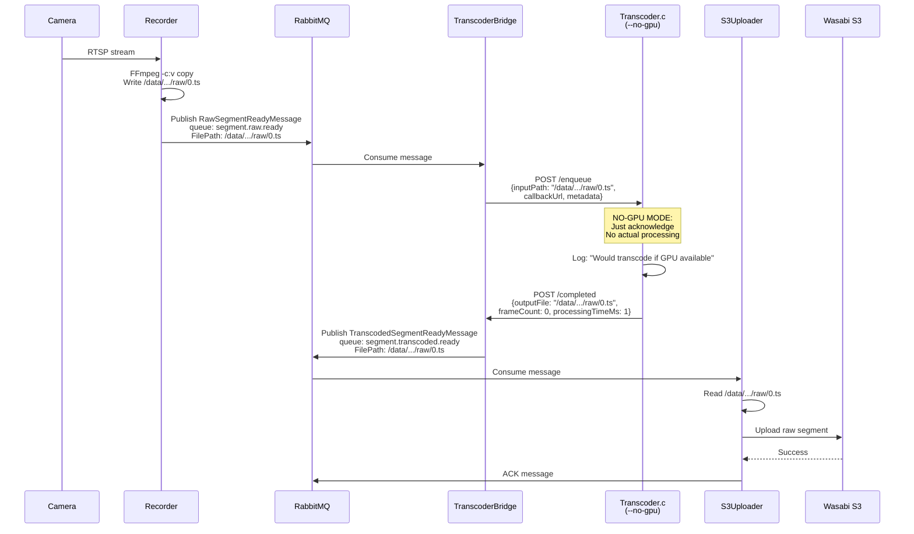
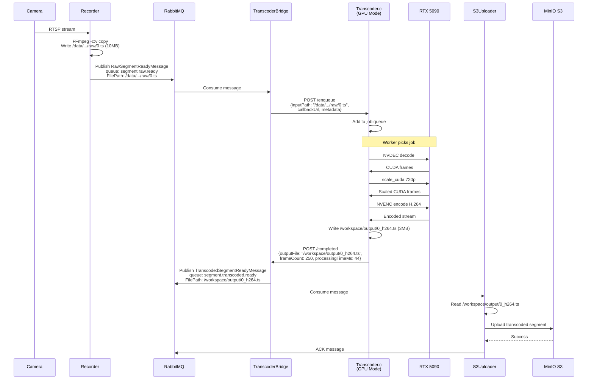
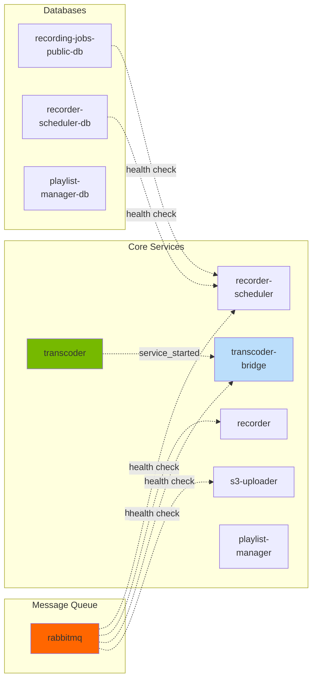

# CloudCam GPU Transcoder Integration - Architecture Diagrams

**Created**: 2025-10-23
**Purpose**: Visual architecture overview for Phase 1 and Phase 2 implementations

---

## Phase 1: Test Server Architecture (No GPU)

**Environment**: Test server WITHOUT GPU hardware
**S3 Storage**: Wasabi S3
**Transcoding**: Acknowledgment only (no actual processing)

```mermaid
graph TB
    subgraph "Camera Source"
        CAM[IP Camera<br/>RTSP Stream]
    end

    subgraph "Recorder Service"
        REC[Recorder<br/>FFmpeg -c:v copy]
        RECSQLITE[(SQLite<br/>Sessions)]
        REC --> RECSQLITE
    end

    subgraph "Message Bus"
        RMQ{RabbitMQ<br/>cloudcam vhost}
    end

    subgraph "TranscoderBridge Service .NET"
        BRIDGE[TranscoderBridge<br/>Background Service]
        WEBHOOK[Webhook Controller<br/>/completed endpoint]
        WEBHOOK --> BRIDGE
    end

    subgraph "Transcoder Service C"
        TAPI[HTTP API Server<br/>libmicrohttpd]
        TWORKER[Worker Thread<br/>--no-gpu mode]
        TAPI --> TWORKER
    end

    subgraph "S3Uploader Service"
        S3UP[S3Uploader<br/>MinIO Client]
    end

    subgraph "Storage - Test Server"
        RAWFS[/data/.../raw/<br/>Raw Segments<br/>copy codec]
        WASABI[(Wasabi S3<br/>Test Bucket)]
    end

    subgraph "Databases"
        PGPUBLIC[(PostgreSQL<br/>cloudcam_public)]
        PGSCHED[(PostgreSQL<br/>recorder_scheduler)]
    end

    %% Flow
    CAM -->|RTSP| REC
    REC -->|Write Raw TS| RAWFS
    REC -->|segment.raw.ready| RMQ

    RMQ -->|Consume| BRIDGE
    BRIDGE -->|POST /enqueue<br/>inputPath + metadata| TAPI

    TWORKER -->|No processing<br/>Just acknowledge| TWORKER
    TWORKER -->|POST /completed<br/>outputFile = inputFile| WEBHOOK

    BRIDGE -->|segment.transcoded.ready<br/>FilePath = raw segment| RMQ
    RMQ -->|Consume| S3UP

    S3UP -->|Read Raw| RAWFS
    S3UP -->|Upload| WASABI

    REC -.->|Session tracking| RECSQLITE
    REC -.->|Recording jobs| PGPUBLIC

    %% Styling
    style CAM fill:#e1f5ff
    style RMQ fill:#ff6600
    style WASABI fill:#569A31
    style RAWFS fill:#e1e1e1
    style TWORKER fill:#ffeb3b,stroke:#f57c00,stroke-width:3px

    classDef phaseOne fill:#bbdefb,stroke:#1976d2,stroke-width:2px
    class BRIDGE,WEBHOOK,TAPI,TWORKER phaseOne
```

### Phase 1 Message Flow



---

## Phase 2: GPU Server Architecture (Production)

**Environment**: Server WITH RTX 5090 GPU
**S3 Storage**: MinIO (Production)
**Transcoding**: Real GPU NVENC/NVDEC processing

```mermaid
graph TB
    subgraph "Camera Source"
        CAM[IP Camera<br/>RTSP Stream]
    end

    subgraph "Recorder Service"
        REC[Recorder<br/>FFmpeg -c:v copy]
        RECSQLITE[(SQLite<br/>Sessions)]
        REC --> RECSQLITE
    end

    subgraph "Message Bus"
        RMQ{RabbitMQ<br/>cloudcam vhost}
    end

    subgraph "TranscoderBridge Service .NET"
        BRIDGE[TranscoderBridge<br/>Background Service]
        WEBHOOK[Webhook Controller<br/>/completed endpoint]
        WEBHOOK --> BRIDGE
    end

    subgraph "Transcoder Service C"
        TAPI[HTTP API Server<br/>libmicrohttpd]
        TQUEUE[Job Queue<br/>2000 capacity]
        WORKER1[Worker 1<br/>NVDEC→NVENC]
        WORKER2[Worker 2<br/>NVDEC→NVENC]
        WORKERN[Worker N<br/>14 total workers]
        TAPI --> TQUEUE
        TQUEUE --> WORKER1
        TQUEUE --> WORKER2
        TQUEUE --> WORKERN
    end

    subgraph "S3Uploader Service"
        S3UP[S3Uploader<br/>MinIO Client]
    end

    subgraph "Storage - GPU Server"
        RAWFS[/data/.../raw/<br/>Raw Segments<br/>~10MB each]
        TRANSFS[/workspace/output/<br/>Transcoded Segments<br/>720p H.264 ~3MB]
        MINIO[(MinIO S3<br/>Production Bucket)]
    end

    subgraph "GPU Hardware"
        GPU[RTX 5090<br/>NVENC/NVDEC<br/>1374 files/min]
    end

    subgraph "Databases"
        PGPUBLIC[(PostgreSQL<br/>cloudcam_public)]
        PGSCHED[(PostgreSQL<br/>recorder_scheduler)]
    end

    %% Flow
    CAM -->|RTSP| REC
    REC -->|Write Raw TS| RAWFS
    REC -->|segment.raw.ready| RMQ

    RMQ -->|Consume| BRIDGE
    BRIDGE -->|POST /enqueue<br/>inputPath + metadata| TAPI

    WORKER1 -.->|Use GPU| GPU
    WORKER2 -.->|Use GPU| GPU
    WORKERN -.->|Use GPU| GPU

    WORKER1 -->|Read| RAWFS
    WORKER1 -->|Write H.264| TRANSFS
    WORKER2 -->|Read| RAWFS
    WORKER2 -->|Write H.264| TRANSFS

    WORKER1 -->|POST /completed| WEBHOOK
    WORKER2 -->|POST /completed| WEBHOOK

    BRIDGE -->|segment.transcoded.ready<br/>FilePath = transcoded| RMQ
    RMQ -->|Consume| S3UP

    S3UP -->|Read Transcoded| TRANSFS
    S3UP -->|Upload| MINIO

    REC -.->|Session tracking| RECSQLITE
    REC -.->|Recording jobs| PGPUBLIC

    %% Styling
    style CAM fill:#e1f5ff
    style RMQ fill:#ff6600
    style MINIO fill:#569A31
    style RAWFS fill:#e1e1e1
    style TRANSFS fill:#c8e6c9
    style GPU fill:#76b900,stroke:#33691e,stroke-width:3px

    classDef phaseTwo fill:#fff9c4,stroke:#f57f17,stroke-width:2px
    class WORKER1,WORKER2,WORKERN phaseTwo
```

### Phase 2 Message Flow



---

## Comparison: Phase 1 vs Phase 2

| Aspect | Phase 1 (Test Server) | Phase 2 (GPU Server) |
|--------|----------------------|---------------------|
| **GPU Hardware** | ❌ None | ✅ RTX 5090 |
| **Transcoder Mode** | `--no-gpu` (acknowledgment) | Normal (GPU transcode) |
| **File Processing** | None (instant ACK) | NVDEC→NVENC pipeline |
| **Processing Time** | 1ms (fake) | ~44ms/file |
| **Output File** | Returns input path | Returns transcoded path |
| **S3 Bucket** | Wasabi (test) | MinIO (production) |
| **File Uploaded** | Raw segment (~10MB) | Transcoded segment (~3MB) |
| **Storage Reduction** | 0% | 71% |
| **What We Test** | Bridge orchestration | Actual transcoding |

---

## Key Architectural Decisions

### 1. **Direct Volume Mounts (No Symlinks)**
Both phases use direct volume mounts:
- Transcoder mounts `recorder_data:/data:ro` (read-only)
- Bridge and S3Uploader mount same volumes
- No symlink management needed

### 2. **Input Path Passthrough**
- **Phase 1**: Transcoder returns `outputFile = inputFile`
- **Phase 2**: Transcoder returns `outputFile = transcoded_path`
- S3Uploader uses returned path directly

### 3. **Same Binary, Different Mode**
- Single transcoder.c binary works for both phases
- Phase 1: Run with `--no-gpu` flag
- Phase 2: Run without flag

### 4. **Environment-Based S3 Config**
- S3 endpoint/bucket configured via environment variables
- Easy switch between Wasabi (test) and MinIO (prod)

---

## Container Dependencies



---

**Document Version**: 1.0
**Last Updated**: 2025-10-23
**Status**: Architecture planning complete
