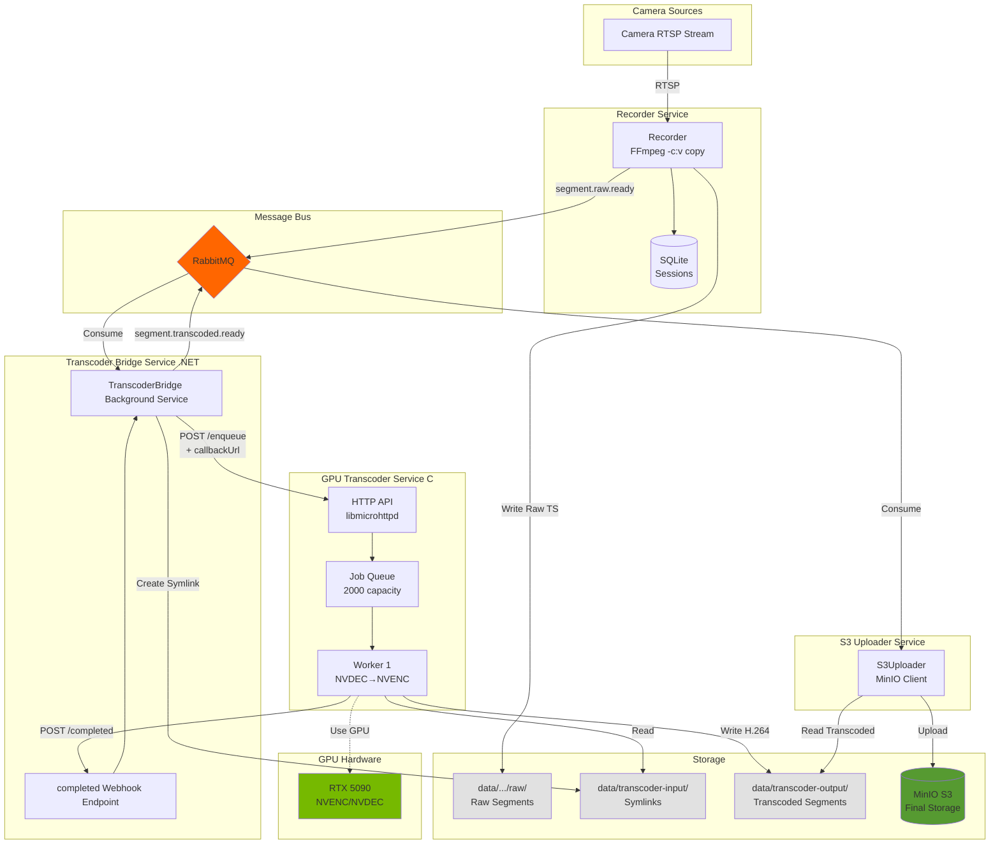
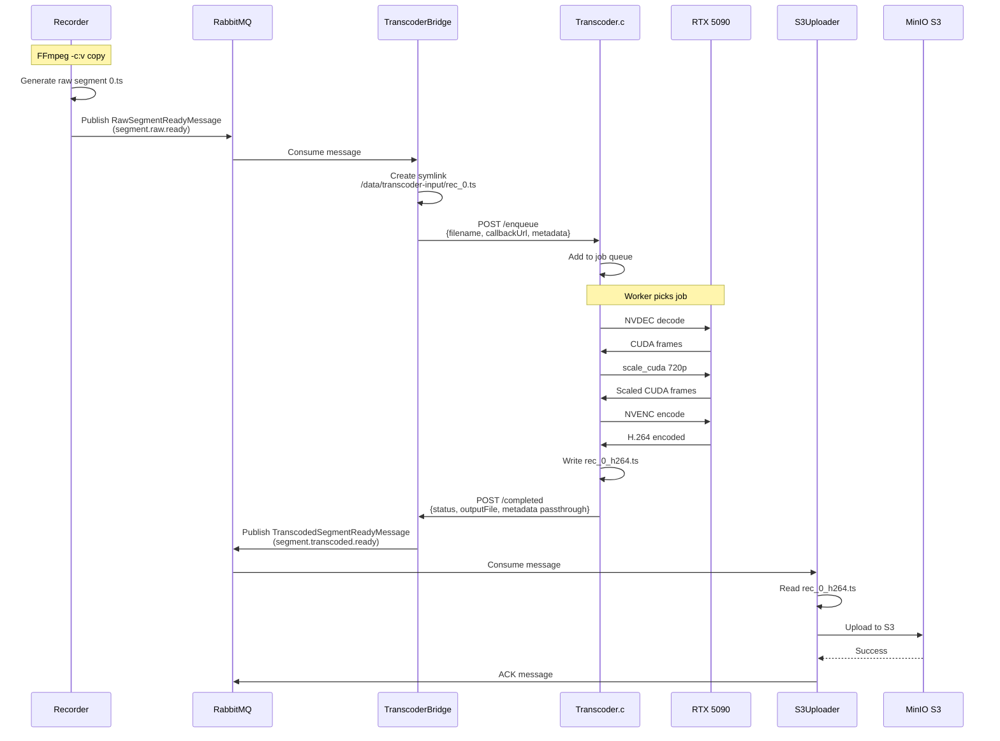

# Transcoder Integration Architecture

**Date**: October 17, 2025
**Status**: Implementation Phase - Test Deployment
**Owner**: System Architecture Team
**Testing Scope**: 2-5 cameras, 1-2 hour validation on test server

---

## Executive Summary

This document outlines the architectural design for integrating the GPU-accelerated transcoding service into the CloudCam 24/7 recording pipeline. The primary goal is to separate recording from transcoding, enabling efficient GPU-based video processing while maintaining system reliability and scalability.

**Implementation Approach**: This is a test deployment on a non-production server to validate functional requirements with a small camera load (2-5 cameras) over 1-2 hours. Success metrics and quality validation will be performed manually.

---

## Architecture Overview



### Message Flow Detail



---

## Business Requirements

### Current Pain Points
1. **CPU-intensive transcoding during recording** - FFmpeg libx264 encoding consumes significant CPU resources
2. **Limited flexibility** - Changing encoding parameters requires redeploying Recorder service


### Goals
1. **Separate recording from transcoding** - Recorder uses copy codec, dedicated GPU service handles transcoding
2. **GPU acceleration** - Leverage RTX 5090 NVENC/NVDEC for hardware transcoding (1,374 files/minute capability)
3. **71% storage reduction** - Tested compression from 6.5GB to 1.9GB with maintained quality
4. **Minimal latency** - Add negligible overhead to segment-to-S3 pipeline

---

## Architectural Decisions

### Decision 1: New Recording Pipeline (Copy Codec)

**Current Flow:**
```
Recorder → FFmpeg (libx264 encode) → HLS segments → S3Uploader → S3
```

**New Flow:**
```
Recorder → FFmpeg (copy codec) → Raw segments → RabbitMQ → Transcoder → Transcoded segments → S3Uploader → S3
```

**Rationale:**
- Recording becomes pure capture operation (minimal CPU)
- Transcoding offloaded to dedicated GPU workers
- Decouples concerns: recording availability vs transcoding performance

---

### Decision 2: Message-Driven Integration via RabbitMQ

**New Queues:**

| Queue Name | Type | Producer | Consumer | Purpose |
|------------|------|----------|----------|---------|
| `segment.raw.ready` | Direct | Recorder | Transcoder Bridge | Notify new raw segments available |
| `segment.transcoded.ready` | Direct | Transcoder Bridge | S3Uploader | Notify transcoded segments ready for upload |

**New Messages:**

**RawSegmentReadyMessage:**
```json
{
  "recordingJobId": "uuid",
  "recordingId": "uuid",
  "fileName": "0.ts",
  "filePath": "/data/job-id/recording-id/0.ts",
  "fileSize": 10485760,
  "segmentStart": "2024-01-01T00:00:00Z",
  "segmentEnd": "2024-01-01T00:00:10Z",
  "segmentDuration": 10
}
```

**TranscodedSegmentReadyMessage:**
```json
{
  "recordingJobId": "uuid",
  "recordingId": "uuid",
  "fileName": "0_h264.ts",
  "filePath": "/data/transcoded/recording-id/0_h264.ts",
  "fileSize": 3145728,
  "segmentStart": "2024-01-01T00:00:00Z",
  "segmentEnd": "2024-01-01T00:00:10Z",
  "segmentDuration": 10,
  "resolution": "1280x720",
  "compressionRatio": 0.30
}
```

**Rationale:**
- Consistent with existing system architecture (all services use RabbitMQ)
- Natural decoupling - services don't need direct knowledge of each other
- Easy horizontal scaling - multiple transcoder instances can consume same queue
- Retry and failure handling built into RabbitMQ

---

### Decision 3: .NET Bridge Service (Not Native C RabbitMQ)

**Architecture:**
```
┌──────────┐  RabbitMQ          ┌─────────────────┐  HTTP API      ┌────────────┐
│ Recorder ├───segment.raw──────>│ Transcoder      │───/enqueue────>│ transcoder │
└──────────┘   .ready            │ Bridge Service  │                │    .c      │
                                 │ (.NET)          │                │ (daemon)   │
                                 │                 │                └─────┬──────┘
                                 │  ┌──────────────┤                      │
                                 │  │ /completed   │◄──────────────────────┘
                                 │  │ (webhook)    │   HTTP callback
                                 └──┴──────────────┘
                                    │
                                    │ segment.transcoded.ready
                                    ▼
                                 ┌─────────────────┐
                                 │  S3Uploader     │
                                 └─────────────────┘
```

**Options Evaluated:**

| Approach | Pros | Cons | Decision |
|----------|------|------|----------|
| **Native C with librabbitmq-c** | Lower latency, fewer moving parts | Modify working transcoder.c, harder to maintain | ❌ Rejected |
| **.NET Bridge Service** | Consistent with system, easy to maintain, don't touch working code | Extra service (+20ms latency) | ✅ **SELECTED** |


**Rationale:**
1. **Don't modify working code** - transcoder.c is battle-tested at 1,374 files/min, proven stable
2. **Consistency** - All other services (Recorder, RecorderScheduler, S3Uploader, PlaylistManager) use .NET + RabbitMQ pattern
3. **Maintainability** - .NET developers can debug/modify bridge without C expertise
4. **Separation of concerns** - Transcoder does transcoding, bridge does messaging orchestration
5. **Minimal overhead** - HTTP proxy latency (~10-20ms) is negligible compared to transcoding time (~44ms/file)

---

### Decision 4: Callback-Based Completion Detection

**Options Evaluated:**

| Approach | Latency | Reliability | Complexity | Decision |
|----------|---------|-------------|------------|----------|
| **File watcher polling** | 100-1000ms | Medium (timing issues) | Low | ❌ Rejected |
| **Database polling** | 500-2000ms | High | Medium | ❌ Rejected |
| **HTTP callback webhook** | <10ms | High | Low | ✅ **SELECTED** |
| **Native RabbitMQ in C** | <5ms | High | High | ❌ Rejected (overkill) |

**Selected: HTTP Callback Webhook**

**Flow:**
1. Bridge receives `RawSegmentReadyMessage` from RabbitMQ
2. Bridge POSTs to transcoder `/enqueue` with callback URL and full metadata
3. Transcoder processes file (NVDEC → scale_cuda → NVENC)
4. Transcoder POSTs completion notification to bridge webhook with metadata passthrough
5. Bridge publishes `TranscodedSegmentReadyMessage` to RabbitMQ using returned metadata

**Enhanced Transcoder API:**

**POST /enqueue** (modified):
```json
{
  "filename": "recording-id_0.ts",
  "callbackUrl": "http://transcoder-bridge:8081/completed",
  "metadata": {
    "recordingJobId": "uuid",
    "recordingId": "uuid",
    "segmentStart": "2024-01-01T00:00:00Z",
    "segmentDuration": 10
  }
}
```

**POST /completed** (transcoder → bridge):
```json
{
  "inputFile": "recording-id_0.ts",
  "outputFile": "recording-id_0_h264.ts",
  "frameCount": 250,
  "status": "completed",
  "processingTimeMs": 44,
  "metadata": {
    "recordingJobId": "uuid",
    "recordingId": "uuid",
    "segmentStart": "2024-01-01T00:00:00Z",
    "segmentDuration": 10
  }
}
```

**Rationale:**
- **Instant notification** - No polling delay, sub-10ms notification latency
- **Minimal transcoder changes** - Just add `notify_completion()` function with libcurl
- **Reliable** - HTTP is well-tested, callbacks are standard pattern (webhooks)
- **Traceable** - Each job has explicit completion event with timing metrics
- **Stateless bridge** - Metadata passed through transcoder, no in-memory storage needed

---

## Modified Service Responsibilities

### Recorder Service (Modified)

**Changes:**
1. **FFmpeg command** - Use `-c:v copy` instead of `-c:v libx264`
2. **Message publishing** - Publish to `segment.raw.ready` instead of `segment.ready`
3. **Storage structure** - Segments written to `/data/{jobId}/{recordingId}/raw/`

**New FFmpeg Command:**
```bash
ffmpeg -rtsp_transport tcp \
       -analyzeduration 1000000 \
       -stimeout 10000000 \
       -i "{rtspUrl}" \
       -t {duration} \
       -c:v copy \                    # ← CHANGED: No transcoding
       -f hls \
       -hls_time {segmentInterval} \
       -hls_flags append_list \
       -hls_list_size 0 \
       -hls_segment_filename "%d.ts" \
       "playlist.m3u8"
```

**Impact:**
- CPU usage reduction: ~80% (no encoding)
- Segment generation speed: Limited only by network bandwidth
- Disk usage: Temporary increase (raw segments until transcoded)

---

### Transcoder Bridge Service (New)

**Responsibilities:**
1. **RabbitMQ Consumer** - Consume `segment.raw.ready` queue
2. **File Management** - Create symlinks from recorder storage to transcoder input directory
3. **HTTP Client** - POST to transcoder `/enqueue` API with metadata
4. **Webhook Handler** - Receive completion notifications from transcoder with metadata
5. **RabbitMQ Publisher** - Publish `segment.transcoded.ready` messages
6. **Cleanup** - Remove symlinks after successful processing

**Technology Stack:**
- .NET 9 Background Service
- RabbitMQ.Client library
- HttpClient for transcoder API
- Minimal ASP.NET Core for webhook endpoint

**Scalability:**
- Fully stateless design (metadata passed through transcoder)
- Can run multiple instances with RabbitMQ work queue pattern

---

### Transcoder Service (Modified)

**Changes:**
1. **Add libcurl dependency** - For HTTP callback notifications
2. **Add `notify_completion()` function** - POST to callback URL after processing
3. **Enhanced /enqueue endpoint** - Accept `callbackUrl` and `metadata` parameters
4. **Metadata passthrough** - Return metadata in callback payload

**No changes to:**
- Core transcoding pipeline (NVDEC → scale_cuda → NVENC)
- Worker thread pool (14 workers for 2x RTX 5090)
- Queue management (2000 item capacity)
- GPU optimization (persistent pipeline)
- HTTP API server (libmicrohttpd)

**Performance:**
- Current: 1,374 files/minute
- With callback overhead: ~1,370 files/minute (negligible impact)

---

### S3Uploader Service (Modified)

**Changes:**
1. **Queue name** - Consume from `segment.transcoded.ready` instead of `segment.ready`
2. **Message type** - Handle `TranscodedSegmentReadyMessage` instead of `SegmentReadyMessage`
3. **File paths** - Read from transcoder output directory instead of recorder directory

**No changes to:**
- S3 upload logic
- MinIO client integration
- Retry mechanisms
- Playlist upload handling

---

## Storage Management

### Directory Structure

**Before (Current):**
```
/data/
└── {RecordingJobId}/
    └── {RecordingId}/
        ├── 0.ts (transcoded during recording)
        ├── 1.ts
        ├── playlist.m3u8
        └── ...
```

**After (New):**
```
/data/
└── {RecordingJobId}/
    └── {RecordingId}/
        └── raw/
            ├── 0.ts (copy codec, original bitrate ~10MB)
            ├── 1.ts
            └── playlist.m3u8

/data/transcoder-input/
└── {RecordingId}_0.ts (symlink to raw/0.ts)
└── {RecordingId}_1.ts (symlink to raw/1.ts)
└── ...

/data/transcoder-output/
└── {RecordingId}_0_h264.ts (transcoded 720p ~3MB)
└── {RecordingId}_1_h264.ts
└── ...
```

---

## Performance Analysis

**Test Load (2-5 cameras):**
- 12-30 segments/minute vs 1,350 files/min transcoder capacity
- **45-112x headroom** - transcoder capacity far exceeds test requirements

**Resource Utilization:**
- Recorder CPU: ~80% → ~15% (copy codec saves 65%)
- GPU: RTX 5090 NVENC/NVDEC with 40-50% headroom
- Power: 160W average, 190W peak

---

## Failure Handling

**Key Recovery Mechanisms:**
- **Transcoder/Bridge Failure**: RabbitMQ message requeue, persistent queues
- **Callback Timeout**: 30s timeout, retry with NACK/requeue
- **S3 Upload Failure**: Standard retry via existing S3Uploader mechanisms
- **Missing Files**: Bridge retries 3 times before NACK

**RabbitMQ Reliability:**
- Durable queues with message persistence
- Publisher confirms enabled
- Prefetch count: 5

---

## Deployment Strategy

**Environment**: Test server with existing camera-v2 infrastructure
**Deployment Method**: Extend existing `camera-v2/docker-compose.yml` with new services
**Test Validation**: Manual camera setup (2-5 cameras) and quality checks by operator

### Docker Compose Configuration

Add to existing `camera-v2/docker-compose.yml`:

```yaml
  # GPU Transcoder Service
  transcoder:
    build: ./Transcoder
    container_name: camera-v2-transcoder
    volumes:
      - /data/transcoder-input:/workspace/tsfiles
      - /data/transcoder-output:/workspace/output
    deploy:
      resources:
        reservations:
          devices:
            - driver: nvidia
              count: 1
              capabilities: [gpu]
    ports:
      - "8080:8080"
    restart: unless-stopped
    labels:
      - "com.docker.compose.project=camera-v2"
      - "com.docker.compose.service=transcoder"

  # Transcoder Bridge Service
  transcoder-bridge:
    build: ./TranscoderBridge
    container_name: camera-v2-transcoder-bridge
    depends_on:
      rabbitmq:
        condition: service_healthy
      transcoder:
        condition: service_started
    environment:
      ASPNETCORE_ENVIRONMENT: Development
      Transcoder__ApiUrl: "http://transcoder:8080"
      RabbitMQ__Host: "rabbitmq"
      RabbitMQ__Port: "5672"
      RabbitMQ__Username: "dev"
      RabbitMQ__Password: "${RABBITMQ_PASSWORD}"
      RabbitMQ__VirtualHost: "cloudcam"
      TranscoderBridge__DataPath: "/data"
      TranscoderBridge__InputPath: "/data/transcoder-input"
      TranscoderBridge__OutputPath: "/data/transcoder-output"
    volumes:
      - recorder_data:/data:ro
      - /data/transcoder-input:/data/transcoder-input
      - /data/transcoder-output:/data/transcoder-output
    ports:
      - "8085:8080"  # Webhook endpoint
    restart: unless-stopped
    labels:
      - "com.docker.compose.project=camera-v2"
      - "com.docker.compose.service=backend"
```

---

## References

### Related Documents
- [SYSTEM_ARCHITECTURE.md](./SYSTEM_ARCHITECTURE.md) - Overall system architecture
- [Transcoder.md](./Transcoder.md) - GPU transcoder technical details
- [transcoder.c](./transcoder.c) - Transcoder implementation
- [Recorder SERVICE_ANALYSIS.md](./camera-v2/Recorder/SERVICE_ANALYSIS.md) - Recorder service details
- [S3Uploader SERVICE_ANALYSIS.md](./camera-v2/S3Uploader/SERVICE_ANALYSIS.md) - S3 uploader details

---

**Document Version**: 1.1
**Last Updated**: October 17, 2025 - Updated for test deployment
